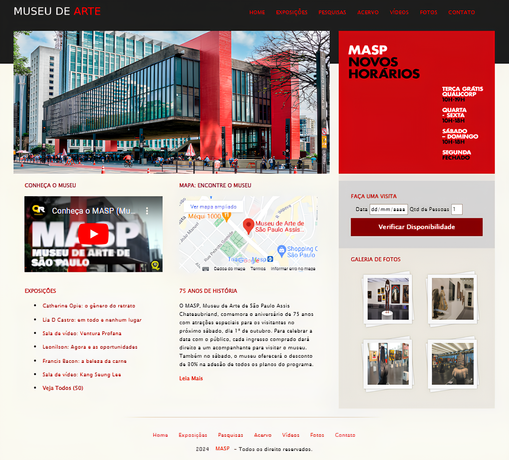

# Museu De Arte

## Descrição
Este projeto é um site para um museu de arte, fornecendo informações sobre exposições, vídeos, fotos e eventos históricos. Inclui uma galeria de fotos, um mapa de localização e um formulário para agendamento de visitas. Desenvolvido com HTML, CSS e integração de vídeos do YouTube e mapas do Google.

## Tecnologias Utilizadas
- HTML
- CSS

## Estrutura do Projeto
- `index.html`: Página principal do site.
- `CSS/normalize.css`: Arquivo CSS para normalização de estilos entre navegadores.
- `CSS/estilo.css`: Arquivo de estilo CSS customizado.
- `Imagens/`: Diretório contendo imagens usadas no site.

## Instruções para Configuração e Execução Local
1. Clone o repositório:
    ```bash
    git clone https://github.com/seu-usuario/museu-de-arte.git
    ```
2. Navegue até o diretório do projeto:
    ```bash
    cd museu-de-arte
    ```
3. Abra o arquivo `index.html` no seu navegador preferido.

## Fontes de Integração
- **Conheça o Museu**: [YouTube](https://www.youtube.com/embed/IkHA0Ih6N_k?si=EjWLQikj9PkZtaxB)
- **Mapa: Encontre o Museu**: [Google Maps](https://www.google.com/maps/embed?pb=!1m18!1m12!1m3!1d3657.195697374655!2d-46.658456824669926!3d-23.561413978799674!2m3!1f0!2f0!3f0!3m2!1i1024!2i768!4f13.1!3m3!1m2!1s0x94ce59ceb1eb771f%3A0xe904f6a669744da1!2sMuseu%20de%20Arte%20de%20S%C3%A3o%20Paulo%20Assis%20Chateaubriand!5e0!3m2!1spt-BR!2sbr!4v1721776222422!5m2!1spt-BR!2sbr)


## Referências
- **MASP - Museu de Arte de São Paulo Assis Chateaubriand**: [Site Oficial](https://masp.org.br/)


## Imagem da Home


